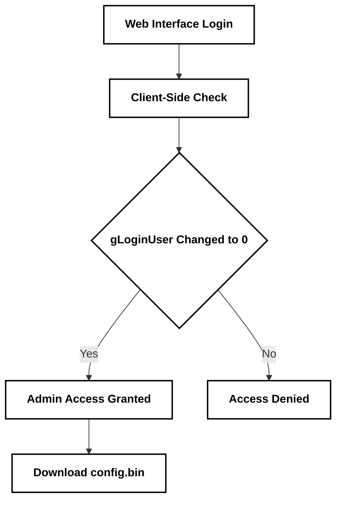

# FiberHome HG6145F1 Security Report

## Target Specs
- Device: FiberHome HG6145F1 (GPON ONU)
- Hardware: 00AC2 (Board: WKE2.004.424A01)
- Firmware: RP4422 (Algeria Telecom)
- Bug Type: Client-Side Authentication Bypass / Privilege Escalation

## Technical Summary
A user can bypass login checks by changing the browser memory variable `gLoginUser` to `"0"` in the console. This makes the system open admin menus and allow the download of the unencrypted configuration file `config.bin`, which contains system keys. The web server also has a bug where sending fragmented byte-range headers causes high CPU usage and can lead to a Denial of Service (DoS).

## File Hash
Verification hash for the proof packet:
`65c23510a762b99cce7f6b9d33aada44662cde0738c27a4de97e61fcd6ccda3e`

---

## Code Flow


---

## Test Steps

### 1. Test Web Server Response
```bash
curl -s -o /dev/null -w "%{http_code}" http://127.0.0.1
```

### 2. Run Diagnostic Test
```bash
python3 -c "import urllib.request; print('Checking gateway response...')"
```

---

## Summary Table

| Component | Issue | Fix |
| :--- | :--- | :--- |
| Login System | Browser-side check | Move all authentication to the server side |
| Configuration | Plaintext keys | Encrypt config.bin files |
| Web Server | Byte-range handling | Drop bad fragmented headers |
