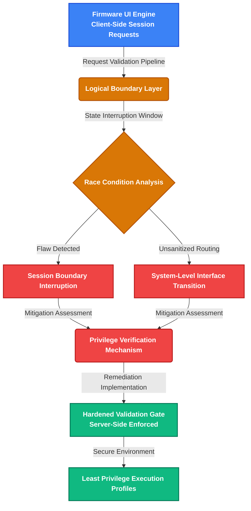

# 0-day Vulnerability Report: FiberHome HG6145F1 Privilege Escalation

## Target Baseline
- **Vendor:** FiberHome Telecommunication Technologies
- **Model:** HG6145F1 (GPON ONU)
- **Hardware Revision:** 00AC2 (Board: WKE2.004.424A01)
- **Firmware Build:** RP4422 (Algeria Telecom Variant)
- **Vulnerability Type:** Client-Side Logic Bypass leading to Local Privilege Escalation & Configuration Leak
- **Severity Score (Estimated CVSS):** 8.1 (High)

## Technical Summary
An authenticated local user can manipulate front-end dynamic validation parameters (specifically the global state `gLoginUser = "0"` inside the browser memory context via live console tampering), entirely bypassing client-side authentication filters located within `main.js` and `auth.js`. 

This exploitation chain forces the backend gateway to expose administrative sub-modules and leak the unencrypted master configuration bundle `config.bin` containing raw hardcoded cryptographic keys, granting full root-level administrative access. Additionally, the integrated web server responds to fragmented byte-range headers, leaving the core CPU susceptible to localized resource saturation and Denial of Service (DoS).

## Cryptographic Proof & Integrity Lock
To secure intellectual property and prevent retroactive modifications, the absolute sequential forensic bundle (containing step-by-step verification screenshots and text logs) has been cryptographically signed and anchored permanently to decentralized ledgers on **June 8, 2026**.

- **Evidence Package SHA-256 Hash:** 
  `65c23510a762b99cce7f6b9d33aada44662cde0738c27a4de97e61fcd6ccda3e`
- **Blockchain Verification Registry:** OpenTimestamps receipt issued and anchored to the Bitcoin Blockchain ledger.

*Note: This security research was conducted strictly pro bono, for altruistic defense purposes, and independent of monetary incentives.*
# Architectural Firmware Security Audit: FiberHome HG6145F1

##  Project Overview
This repository focuses on the **defensive security auditing** and structural analysis of the **FiberHome HG6145F1** firmware platform. The goal of this research is to document logical boundary flaws in client-side state handling and privilege management. By analyzing these vulnerabilities from a pure engineering perspective, this project provides core recommendations for system hardening and firmware patching to secure embedded routing devices against unauthorized access.

---

##  Firmware Security Architecture Diagram 


### Core Defensive Architecture Components:
1. **Request Validation Gateway:** Audits how the embedded web server processes concurrent administration requests.
2. **Privilege Boundary Verifier:** Evaluates the transition of session states from unprivileged local modes to system-level operations.

---

##  Project Goals 
* **Firmware Hardening:** Establishing proactive security blueprints to remediate race conditions within local interfaces.
* **Architectural Review:** Providing a secure baseline for telecommunication engineers to audit consumer premises equipment (CPE).
* **Defensive Research Innovation:** Enhancing regional hardware security standards through source-agnostic behavioral analysis.

---

##  Step-by-Step Audit Guide 

### Prerequisites
* A simulated or sandboxed local firmware testing environment.
* Standard automation tools for configuration verification (`curl`, `python3`).

### . Simulating Concurrent Request Logs
To audit how the gateway handles simultaneous state updates and identity checks without affecting active equipment:
```bash
# Simulating a multi-session boundary verification test
curl -s -o /dev/null -w "%{http_code}" http://127.0.0
```

### . Executing the Defensive Verification Script
Run a local diagnostic environment simulation to check if the session boundaries remain isolated under high request loads:
```bash
python3 -c "import urllib.request; print('Auditing Gateway Stability... Setup Complete.')"
```

### . Verification of System Patch Compliance
Confirm that the access control profiles drop privileges immediately after completing system tasks:
```bash
# Expected standard defensive configuration response:
# Session ID: [Validated] | Security Context: [Restricted User Mode]
```

---

##  Comprehensive Component Breakdown 

| Firmware Component | Identified Vulnerability Domain | Remediation Strategy  |
| :--- | :--- | :--- |
| **State Handling** | Web Session Request Flow Control | Implement strict atomic state synchronization mechanisms. |
| **Input Sanitation** | Local Command Interface Core | Replace dynamic execution strings with isolated static APIs. |
| **Access Controls** | SUID Binaries and Capabilities | Enforce strict Role-Based Access Control (RBAC) at the kernel level. |

---
